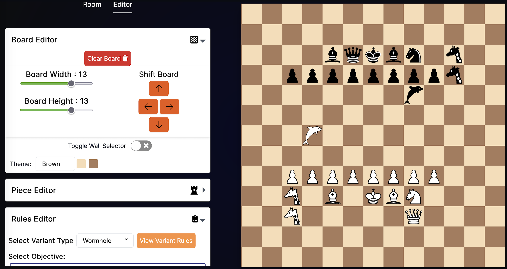
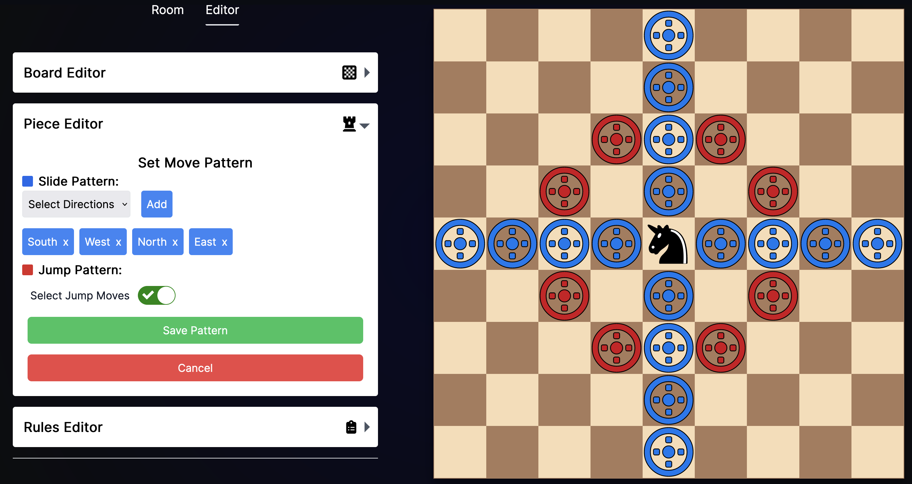
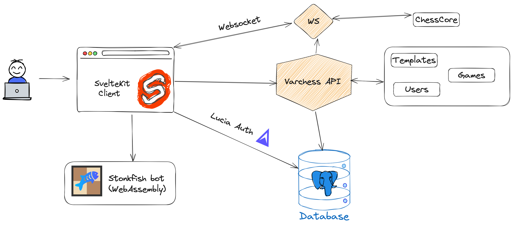

# Varchess

## Overview
Varchess is a multiplayer chess website where you can create your own chess variants. Customizations include variable board dimensions, piece placements, walls, game formats/rules and custom pieces with new movement patterns.

#### Built using SvelteKit, TailwindCSS and Go

Future Plans : 
- Custom Rules and objectives along with new pre-defined variants (teleportation portals, duck chess, long range attacks, poisoned pawn/hidden queen)
- User authentication and save game templates
- Chess engine to mimic computer opponent bot (In the works - [Stonkfish](https://github.com/vishnkr/stonkfish))

## Architecture Overview

### Development branch
Please note that active development is taking place on the `svelte-migrate` branch which contains the most up-to-date source code for the project. 

If you want to access the latest features and updates, please switch to the `svelte-migrate` branch and pull the latest changes. 
