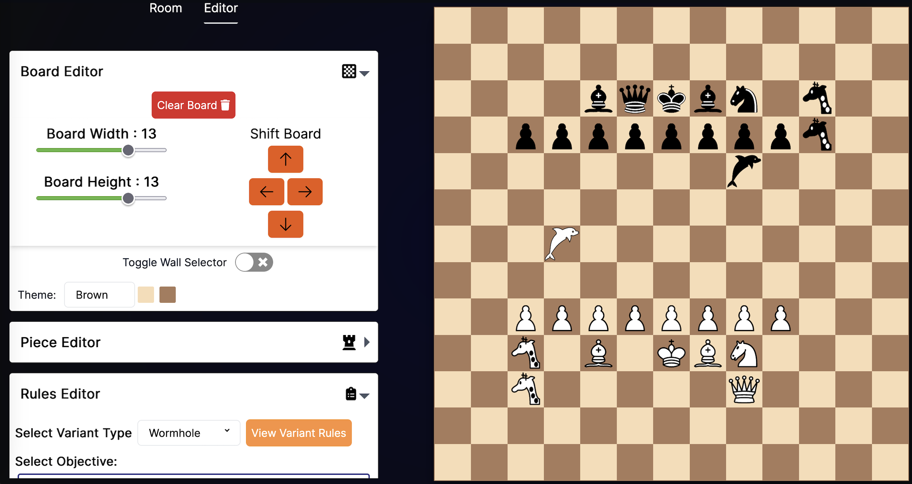
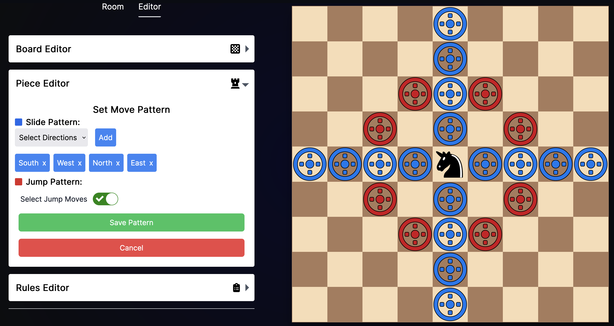
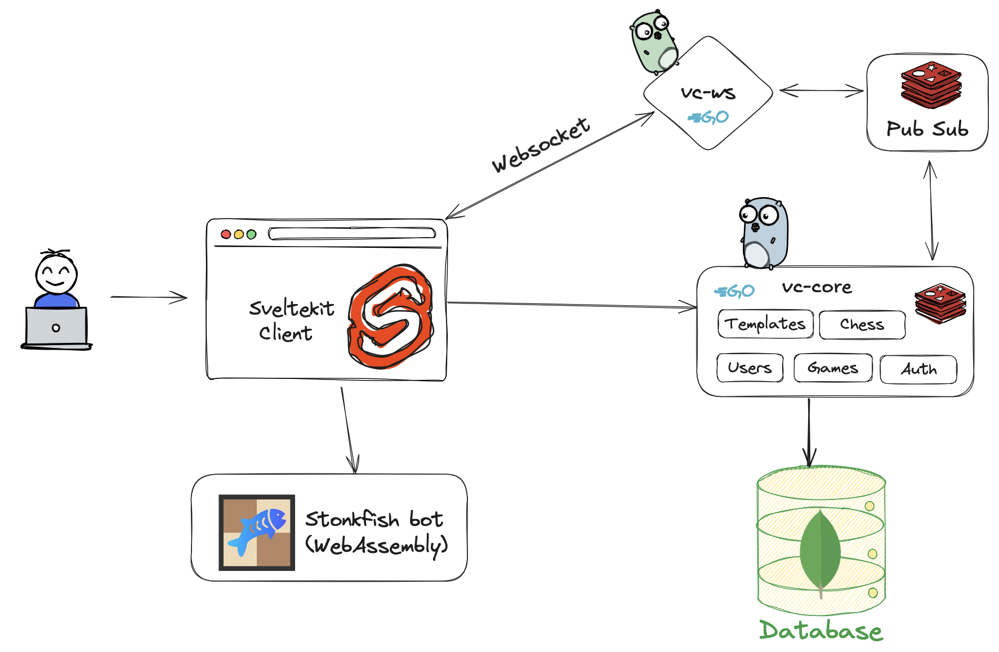

# Varchess

## Overview
Varchess is a multiplayer chess website where you can create your own chess variants. Customizations include variable board dimensions, piece placements, walls, game formats/rules and custom pieces with new movement patterns.

## Architecture Overview

### Current Backend Stack
- **MongoDB** for persistent data storage, including user information and game data.
- **Redis** for in-game state management and publish/subscribe functionality, enabling real-time game updates.

> **Note:** The backend is currently undergoing a redesign. I am exploring a new architecture to improve the scalability and efficiency of the platform. As such, the current backend is not yet stable and is being actively developed.

### Development branch
Please note that active development is taking place on the `main-v1` branch which contains the most up-to-date source code for the project. 
